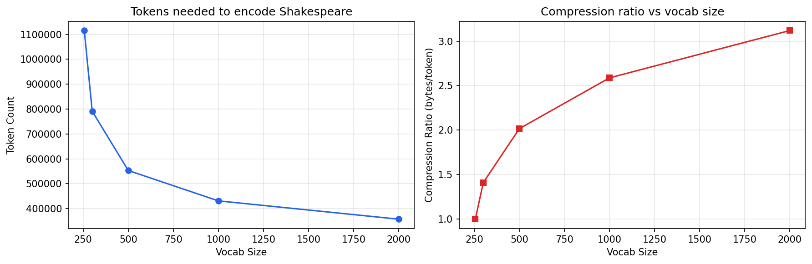

# bytetoken

Byte-pair encoding tokenizer built from scratch. Uses byte-level BPE with regex pre-tokenization, same approach as GPT-2/3/4.

After building [tinylm](https://github.com/mohinpatell/tinylm) with a character-level tokenizer (65 chars), I wanted to understand how real models handle text — turns out it's all about subword tokenization.

## How it works

1. **Pre-tokenize** — split text on word boundaries using GPT-2's regex so merges don't cross words
2. **Train** — start with 256 byte tokens, iteratively merge the most frequent adjacent pair
3. **Encode** — apply learned merges in training order (not by frequency — this matters)

```python
from bpe import BPETokenizer

tok = BPETokenizer()
tok.train(open("data/input.txt").read(), vocab_size=500)

tokens = tok.encode("Hello, world!")
text = tok.decode(tokens)  # "Hello, world!"
```

## Compression

Trained on Shakespeare (~1.1M chars):

| Vocab Size | Tokens | Compression |
|-----------|--------|-------------|
| 256 (raw bytes) | 1,115,394 | 1.0x |
| 500 | 553,176 | 2.0x |
| 1000 | 431,132 | 2.6x |
| 2000 | 357,642 | 3.1x |



## What's in here

- `bpe.py` — BPE tokenizer: train, encode, decode, save/load
- `pretokenize.py` — regex pre-tokenization (GPT-2 pattern)
- `train.py` — train on Shakespeare
- `test_bpe.py` — roundtrip tests + comparison against tiktoken
- `demo.ipynb` — merge visualization, compression analysis
